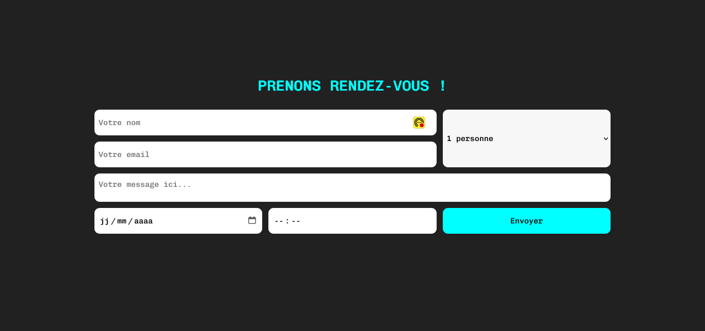

## FORMULAIRE ORGANISE AVEC GRID

## Le challenge

Mon objectif a été de créer un formulaire complexe et de l'organiser avec CSS Grid. Ce mini projet m'a permis de travailler la disposition des éléments en grille.

## Démonstration

Lien vers le projet: https://aperbet56.github.io/formulaire_grid/

## Développez avec

- Utilisation des balises sémantiques HTML5
- CSS
- Flexbox
- Grid (grid-template-columns, grid-template-areas...)
- Animation CSS au focus sur les inputs, le select et la textarea
- Page web responsive
- Desktop first
